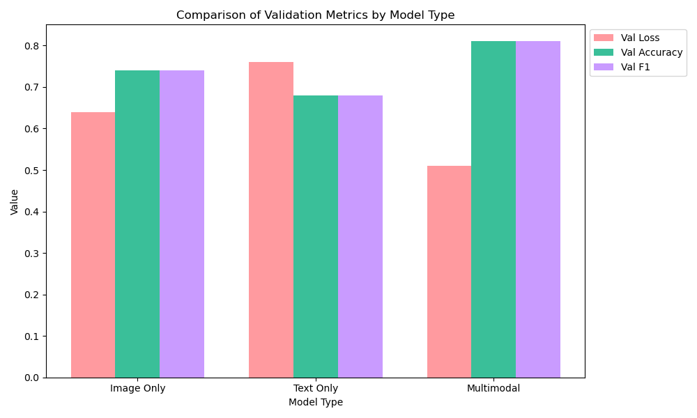

# 实验5：多模态情感分析
10223330406 王菲
## 项目仓库地址
[项目仓库地址](https://github.com/fWang-0406/CAI.git)

---

## 实验任务
给定配对的文本和图像，预测对应的情感标签。  
三分类任务：positive, neutral, negative。  
匿名数据集（实验五数据.zip）  
- `data` 文件夹：包括所有的训练文本和图片，每个文件按照唯一的 `guid` 命名。
- `train.txt`: 数据的 `guid` 和对应的情感标签。
- `test_without_label.txt`：数据的 `guid` 和空的情感标签。

---

## 实验要求
1. 设计一个多模态融合模型。
2. 自行从训练集中划分验证集，调整超参数。
3. 预测测试集（`test_without_label.txt`）上的情感标签。

---

## 实验配置

### 硬件配置
- **CPU**：12th Gen Intel(R) Core(TM) i7-12700H  
- **内核**：14  
- **逻辑处理器**：20  
- **内存**：15.7GB  
- **GPU0**：Intel(R) Iris(R) Xe graphics  
- **GPU1**: NVIDIA GeForce RTX 2050

### 软件配置
- **Pytorch** 版本：2.0.1+cu118
- **Python** 版本：3.9
- **Transformers** 版本：4.45.2

---

## 实验过程

### 1. 数据预处理
由于训练文件是数据的 `guid`，本身没有有效信息，需要通过 `guid` 关联对应的文本和图像内容。通过代码 [data_preprocess.py](codes/data_preprocess.py) 实现，保存对应的 CSV 文件。

#### 数据检查
- 检查所有文本、图像文件是否分别是 `.txt` 和 `.jpg`，结果文件格式一致。

#### 数据分布
- **标签分布**：positive : negative : neutral ≈ 6:3:1，标签分布不均匀。
- **文本长度分布**：文本长度分布在 3-147 之间，长度为 140 的数据约占 1/10。大多数文本长度集中在较短的范围内（0-100 个字符），少数文本长度较长（超过 100 个字符）。
- **图像尺寸分布**：图片的宽度和高度主要集中在较小的范围内（如宽度 600，高度 200-1000）。

### 2. 预训练
基于本实验的硬件配置，选择了较小的预训练模型(也试过更小的**distilcert**和**mobilenet**，效果不及当前预训练模型)
- **文本数据**：使用 BERT 模型进行特征提取。
- **图像数据**：使用 ResNet50 模型进行特征提取。

### 3. 模型构建和训练
设计了三种多模态融合模型：
- **MultimodalClassifier0**：简单的全连接网络，直接拼接文本和图像特征。
- **MultimodalClassifier1**：分别对文本和图像特征进行全连接处理，再拼接后进行最终分类。
- **MultimodalClassifier2**：在 `MultimodalClassifier1` 的基础上增加了注意力机制。

### 4. 模型调优
使用 Optuna 进行超参数调优，调优目标为验证集的 F1 分数
（由于标签分布不均衡，使用f1分数效果优于使用准确率）。

### 5. 生成预测
训练完成后，使用训练好的模型对测试集进行预测，生成情感标签。  
PS. 同样需要将序号和文本、图像相关联；提取文本、图像特征。
---

## 遇到的问题及解决方案

### 1. 原始数据编码问题
- **问题描述**：部分文本文件的编码不一致，导致读取时出现乱码。
- **解决方案**：
  - 使用 `chardet` 库来自动检测文件编码，然后根据检测到的编码读取文件（失败：不同文件编码方式可能存在差异）。
  - 尝试多种解码方式（成功）。通过手动指定常见的编码格式（如 `utf-8`、`gbk`、`latin1` 等），逐步尝试解码，直到成功读取文件。

### 2. 训练数据标签分布不均匀
- **问题描述**：训练数据的标签分布不均匀，positive : negative : neutral ≈ 6:3:1。
- **解决方案**：
  - 对训练集使用过采样（SMOTE）对少数类进行过采样，平衡标签分布。
  - 在损失函数中使用类别权重（`CrossEntropyLoss` 的 `weight` 参数），缓解类别不平衡问题。

### 3. 预训练模型加载时间过长
- **问题描述**：预训练模型加载时间过长，大大降低训练速度。
- **解决方案**：
  - 从官网下载预训练模型文件（如 BERT 和 ResNet50），保存在项目目录中。
  - 每次训练时直接从本地加载预训练模型，避免从网络下载，显著减少了加载时间。

### 4. 显存不足
- **问题描述**：在训练过程中，由于图像特征维度较高，显存不足导致训练中断。
- **解决方案**：
  - 减小 `batch_size` 或增加 `accumulation_steps`，同时使用梯度累积策略。
  - 使用混合精度训练（AMP），减少显存占用并加速训练。

### 5. 特征维度不一致
- **问题描述**：文本特征和图像特征的维度不一致，直接拼接会导致模型训练困难。
- **解决方案**：
  - 通过全连接层对文本和图像特征进行降维，使它们的维度相近后再拼接。
  - 在 `load_feature.py` 中，使用 `CrossModalProjector` 对文本和图像特征进行投影对齐，确保特征维度一致。

### 6. 文本长度不一致
- **问题描述**：文本长度差异较大，直接输入模型会导致计算效率低下。
- **解决方案**：
  - 对文本进行截断或填充，使其长度一致。
  - 在 `TextFeatureExtractor` 中，设置 `max_length=64`，对文本进行截断或填充，确保所有文本输入长度一致。

### 7. 模型训练速度慢
- **问题描述**：模型训练速度较慢，尤其是多模态融合模型。
- **解决方案**：
  1. **使用混合精度训练（AMP）**：通过 `torch.cuda.amp` 加速模型训练过程。
  2. **多线程数据加载**：在 `DataLoader` 中设置 `num_workers=4`，加速数据预处理和加载过程。
  3. **梯度累积**：通过设置 `accumulation_steps`，模拟更大的 `batch_size`，从而加速训练。
  4. **租用高性能设备**：使用专业平台（如 AWS、Google Cloud 或本地高性能 GPU）加速训练。

---

## 模型设计亮点

### 1. **多模态融合策略**
- **亮点描述**：通过中期融合机制，动态调整文本和图像特征的权重，增强了模型对多模态数据的融合能力。
- **实现细节**：
  - 在 `MultimodalClassifier0` 中，文本和图像特征通过拼接（`torch.cat`）进行融合。
  - 在 `load_feature.py` 中，使用 `CrossModalProjector` 对文本和图像特征进行投影对齐，确保特征维度一致。

### 2. **特征降维**
- **亮点描述**：通过全连接层对文本和图像特征进行降维，减少了高维特征带来的噪声和过拟合风险。
- **实现细节**：
  - 在 `MultimodalClassifier0` 中，使用全连接层将文本和图像特征的维度从高维空间映射到低维空间。
  - 在 `CrossModalProjector` 中，将文本特征从 768 维降维到 256 维，图像特征从 2048 维降维到 256 维。

### 3. **类别权重**
- **亮点描述**：通过类别权重缓解训练数据中标签不平衡的情况。
- **实现细节**：
  - 在 `load_feature.py` 中，计算每个类别的权重，并将其传递给 `CrossEntropyLoss`。
  - 在 `train.py` 中，使用 `CrossEntropyLoss` 的 `weight` 参数，确保模型对少数类样本的关注度更高。

### 4. **混合精度训练**
- **亮点描述**：使用混合精度训练（AMP）加速模型训练并减少显存占用。
- **实现细节**：
  - 在 `train.py` 中，使用 `torch.cuda.amp.autocast` 和 `GradScaler` 实现混合精度训练。
  - 通过混合精度训练，显著减少了显存占用并加速了训练过程。

### 5. **早停机制**
- **亮点描述**：通过早停机制防止模型过拟合。
- **实现细节**：
  - 在 `train.py` 中，设置 `patience=15`，如果验证集损失在 15 个 epoch 内没有下降，则提前停止训练。
  - 早停机制有效防止了模型在验证集上的过拟合。

### 6. **SMOTE 过采样**
- **亮点描述**：使用 SMOTE 对少数类样本进行过采样，平衡训练数据的标签分布。
- **实现细节**：
  - 在 `load_feature.py` 中，对训练集使用 SMOTE 进行过采样，确保每个类别的样本数量均衡。
  - 过采样后，训练集的标签分布更加均衡，模型对少数类样本的学习能力增强。

---

## 多模态融合模型在验证集上的结果

- **MultimodalClassifier0**：验证集准确率为 81%，f1分数0.81
- **MultimodalClassifier1**：验证集准确率为 73%，f1分数0.72
- **MultimodalClassifier2**：验证集准确率为 75%，f1分数0.74  
可见最简单的模型model0在这个数据集上的表现最好，大概是因为训练数据总量过少，不太适合过于复杂的模型
---

## 消融实验结果
#### model0
只输入文本数据

只输入图像数据

多模态融合模型

对比

可见表现：多模态 > 单图像 > 单文本

---

## 参考库
- [Optuna 官方文档](https://optuna.readthedocs.io/en/stable/)
- [PyTorch 官方文档](https://pytorch.org/docs/stable/index.html)
- [Transformers 官方文档](https://huggingface.co/docs/transformers/index)

---

## 参考链接
https://blog.csdn.net/JackCrum/article/details/138815214
https://zhuanlan.zhihu.com/p/639545726

---

## 总结
本次实验通过多模态融合模型（文本 + 图像）进行情感分析，设计了三种不同的模型结构，并通过 Optuna 进行超参数调优，最终选择了性能最佳的模型进行预测。  
实验过程中，针对数据分布不均衡的问题，采用了随机重采样和类别权重等方法，有效提升了模型的性能。  
通过绘制损失、准确率和 F1 分数曲线，分析了模型的训练过程，并通过早停机制避免了过拟合。  
最终，模型在测试集上表现良好，验证了多模态融合模型在情感分析任务中的有效性。  
遗憾的是，期末的事情过多，未能尝试其它时期（早期和晚期）融合，注意力机制也可以更加完善。  
如果硬件和时间允许，尝试更大的预训练模型效果或许更好。  